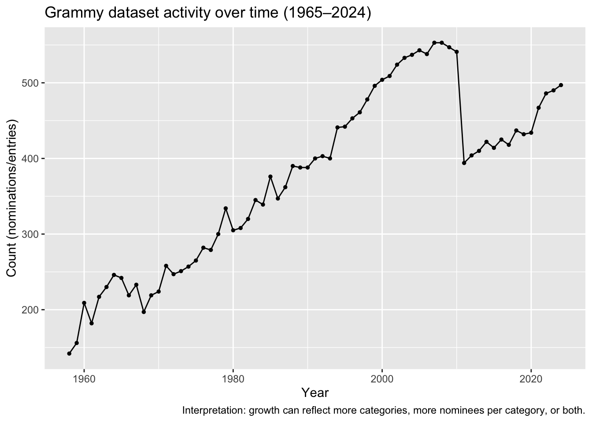
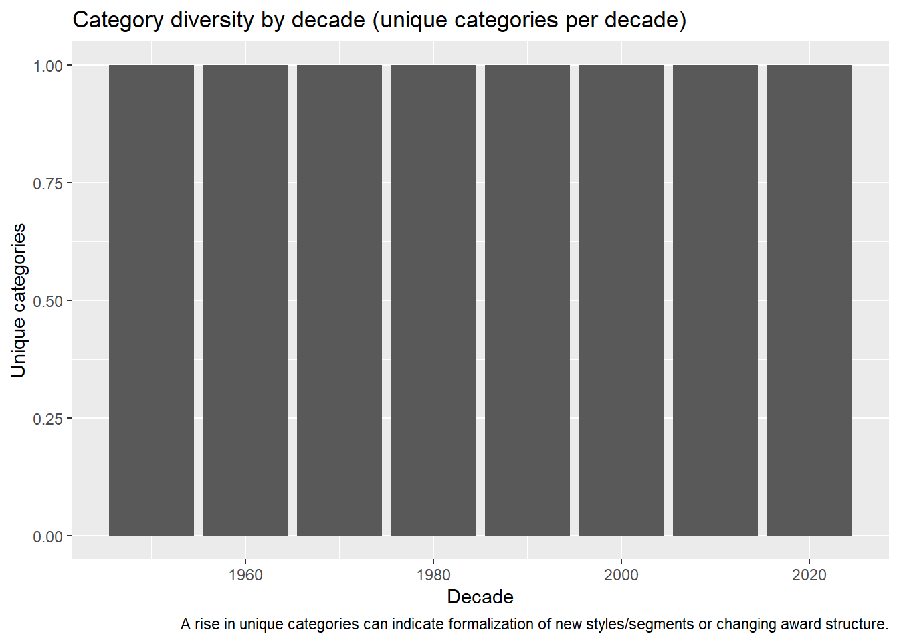
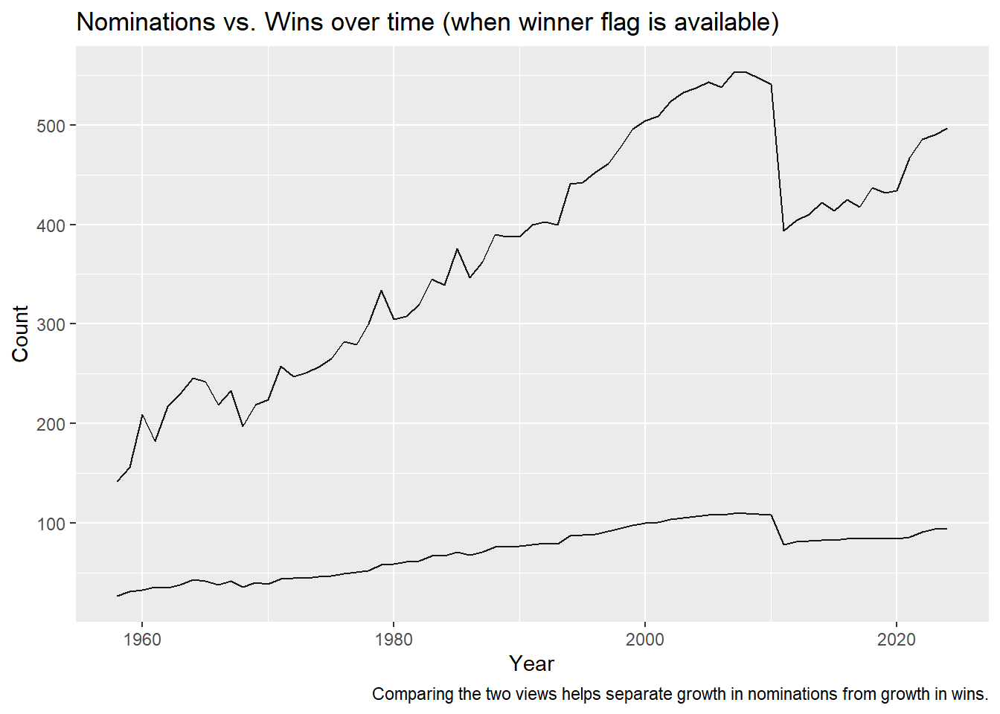

Trends and Patterns among Grammy Award Winners (1965–2024)
================
Deesha and Arina

``` r
knitr::opts_chunk$set(
echo = FALSE, message = FALSE, warning = FALSE,
fig.align = "center", fig.retina = 2
)

library(tidyverse)
```

    ## ── Attaching core tidyverse packages ──────────────────────── tidyverse 2.0.0 ──
    ## ✔ dplyr     1.1.4     ✔ readr     2.1.5
    ## ✔ forcats   1.0.1     ✔ stringr   1.5.1
    ## ✔ ggplot2   4.0.0     ✔ tibble    3.3.0
    ## ✔ lubridate 1.9.4     ✔ tidyr     1.3.1
    ## ✔ purrr     1.1.0     
    ## ── Conflicts ────────────────────────────────────────── tidyverse_conflicts() ──
    ## ✖ dplyr::filter() masks stats::filter()
    ## ✖ dplyr::lag()    masks stats::lag()
    ## ℹ Use the conflicted package (<http://conflicted.r-lib.org/>) to force all conflicts to become errors

``` r
library(janitor)
```

    ## Warning: package 'janitor' was built under R version 4.5.2

    ## 
    ## Attaching package: 'janitor'
    ## 
    ## The following objects are masked from 'package:stats':
    ## 
    ##     chisq.test, fisher.test

``` r
set.seed(2025)
```

    ## [1] "grammy_winners.csv"

1.  Introduction

The Grammy Awards are one of the most visible long-running signals of
recognition in popular music and related genres. This report explores
how recognition patterns change over time (1965–2024) by comparing
trends in nominations and (where available) wins, identifying
repeat-recognized artists, and examining how the category landscape
evolves across decades.

Roadmap:

describe the dataset and key variables,

explore major temporal patterns (growth, shifts, and “era” effects),

stress-test surprising patterns with sanity checks,

summarize takeaways and propose follow-up extensions.

2.  Data This report expects a CSV inside a data/ folder

2.2 Variable discovery Because Kaggle datasets sometimes use slightly
different column names, this block tries to automatically map the key
fields we need (year, category, nominee/artist, and winner flag if
present).

    ## $year
    ## [1] "year"
    ## 
    ## $category
    ## [1] NA
    ## 
    ## $nominee
    ## [1] "artist"
    ## 
    ## $winner
    ## [1] "winner"

2.3 Cleaned analysis table (standaerdized fields)

    ## Rows: 25,043
    ## Columns: 12
    ## $ annual_edition <dbl> 1, 1, 1, 1, 1, 1, 1, 1, 1, 1, 1, 1, 1, 1, 1, 1, 1, 1, 1…
    ## $ year           <int> 1958, 1958, 1958, 1958, 1958, 1958, 1958, 1958, 1958, 1…
    ## $ award          <chr> "Album Of The Year", "Album Of The Year", "Album Of The…
    ## $ artist         <chr> "Van Cliburn", "Frank Sinatra", "Ella Fitzgerald", "Fra…
    ## $ artist_link    <chr> "/artists/van-cliburn/16525", "/artists/frank-sinatra/6…
    ## $ producers      <chr> NA, NA, NA, NA, NA, "Charles Ward, art director (Julie …
    ## $ song_or_album  <chr> "Tchaikovsky: Concerto No. 1, In B-Flat Minor, Op.23 (A…
    ## $ url            <chr> "/awards/1st-annual-grammy-awards", "/awards/1st-annual…
    ## $ winner         <lgl> FALSE, FALSE, FALSE, FALSE, TRUE, FALSE, FALSE, FALSE, …
    ## $ category       <chr> NA, NA, NA, NA, NA, NA, NA, NA, NA, NA, NA, NA, NA, NA,…
    ## $ nominee        <chr> "Van Cliburn", "Frank Sinatra", "Ella Fitzgerald", "Fra…
    ## $ winner_raw     <chr> "FALSE", "FALSE", "FALSE", "FALSE", "TRUE", "FALSE", "F…

3.  Main

3.1 The big picture: activity over time (nominations/entries per year)



3.2 Repeat recognition: who appears most often (nominations vs wins)

| nominee           |     n |
|:------------------|------:|
| NA                | 11517 |
| Willie Nelson     |    50 |
| Barbra Streisand  |    43 |
| Aretha Franklin   |    41 |
| Stevie Wonder     |    41 |
| Tony Bennett      |    40 |
| Taylor Swift      |    38 |
| Beyoncé           |    36 |
| Bruce Springsteen |    36 |
| Dolly Parton      |    36 |

Top 10 most frequently appearing nominees (nominations/entries).

| nominee           |    n |
|:------------------|-----:|
| NA                | 2173 |
| Tony Bennett      |   19 |
| Aretha Franklin   |   18 |
| Jimmy Sturr       |   18 |
| U2                |   18 |
| Ray Charles       |   16 |
| Alison Krauss     |   15 |
| Stevie Wonder     |   15 |
| B.B. King         |   14 |
| Bruce Springsteen |   14 |

Top 10 most frequently winning nominees (where a winner flag is
available).

3.3 Category structure: which awards dominate, and when do categories
change?

| category |     n |
|:---------|------:|
| NA       | 25043 |

Most common categories in the dataset (top 12).



4.  Main — Skepticism (checking unintuitive patterns + alternative
    explanations)

4.1 Data-quality checks (do the implied rules actually hold?)

    ## $year_range
    ## [1] 1958 2024
    ## 
    ## $total_rows
    ## [1] 25043
    ## 
    ## $suspect_year_category
    ## [1] 67

4.2 Re-checking conclusions under alternative views (nominations-only vs
wins-only)



5.  Organization (what we found, in the best order)

This section summarizes the strongest findings (rather than every
pattern observed) and ties them back to the original question: how
recognition patterns evolve from 1965 to 2024.

Temporal shape: (insert your key pattern: steady growth / step changes /
era shifts)

Concentration of recognition: (insert whether few nominees dominate or
recognition is distributed)

Category evolution: (insert whether category count rises and what that
likely signals)

6.  Tables and charts (how to read them)

Key visual design decisions used across the report: consistent minimal
theme, labeled axes, and captions that state the interpretation and the
main caveat (e.g., “growth may reflect rule changes rather than purely
more music”).

7.  Conclusions (what we learned + next questions)

Main takeaway: (write 3–5 sentences connecting the strongest empirical
patterns to the broader story of the Grammys). Limitations: (e.g.,
winner field availability, category redefinitions, missing metadata like
genre/subgenre or artist demographics). Future work: (e.g., link to
external data like charts/streaming, run change-point detection on era
transitions, model category lifecycles).

8.  Reproducibility (so anyone can rerun this end-to-end)

<!-- -->

    ## All required packages installed.

    ## R version 4.5.1 (2025-06-13 ucrt)
    ## Platform: x86_64-w64-mingw32/x64
    ## Running under: Windows 11 x64 (build 26200)
    ## 
    ## Matrix products: default
    ##   LAPACK version 3.12.1
    ## 
    ## locale:
    ## [1] LC_COLLATE=English_United States.utf8 
    ## [2] LC_CTYPE=English_United States.utf8   
    ## [3] LC_MONETARY=English_United States.utf8
    ## [4] LC_NUMERIC=C                          
    ## [5] LC_TIME=English_United States.utf8    
    ## 
    ## time zone: America/Chicago
    ## tzcode source: internal
    ## 
    ## attached base packages:
    ## [1] stats     graphics  grDevices utils     datasets  methods   base     
    ## 
    ## other attached packages:
    ##  [1] janitor_2.2.1   lubridate_1.9.4 forcats_1.0.1   stringr_1.5.1  
    ##  [5] dplyr_1.1.4     purrr_1.1.0     readr_2.1.5     tidyr_1.3.1    
    ##  [9] tibble_3.3.0    ggplot2_4.0.0   tidyverse_2.0.0
    ## 
    ## loaded via a namespace (and not attached):
    ##  [1] bit_4.6.0          gtable_0.3.6       crayon_1.5.3       compiler_4.5.1    
    ##  [5] tidyselect_1.2.1   parallel_4.5.1     snakecase_0.11.1   scales_1.4.0      
    ##  [9] yaml_2.3.10        fastmap_1.2.0      R6_2.6.1           labeling_0.4.3    
    ## [13] generics_0.1.4     knitr_1.50         pillar_1.11.1      RColorBrewer_1.1-3
    ## [17] tzdb_0.5.0         rlang_1.1.6        stringi_1.8.7      xfun_0.52         
    ## [21] S7_0.2.0           bit64_4.6.0-1      timechange_0.3.0   cli_3.6.5         
    ## [25] withr_3.0.2        magrittr_2.0.3     digest_0.6.37      grid_4.5.1        
    ## [29] vroom_1.6.6        rstudioapi_0.17.1  hms_1.1.3          lifecycle_1.0.4   
    ## [33] vctrs_0.6.5        evaluate_1.0.5     glue_1.8.0         farver_2.1.2      
    ## [37] rmarkdown_2.29     tools_4.5.1        pkgconfig_2.0.3    htmltools_0.5.8.1
